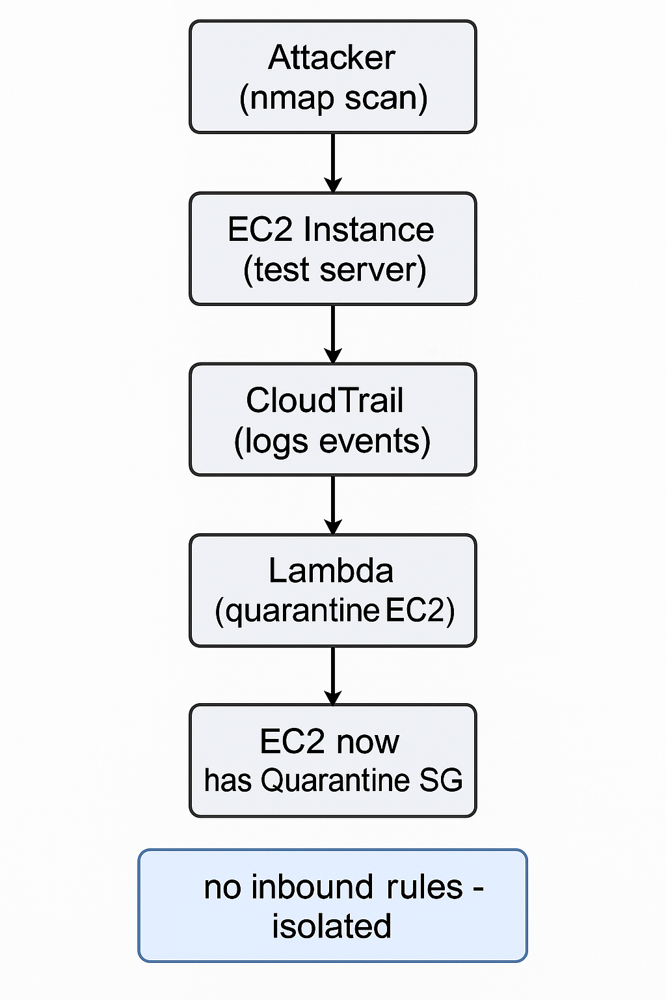

## AWS Incident Response & Automated Quarantine Lab

Implemented real-time threat detection and automated response in AWS using GuardDuty, CloudTrail, and Lambda to detect, investigate, and isolate EC2 security incidents.

---

## Table of Contents

- [Overview]
- [Real-World Risk]
- [What I Built]
- [Diagram]
- [Objectives]
- [Steps Performed]
  - [1. Enable GuardDuty & CloudTrail]
  - [2. Launch and Configure EC2 Test Instance]
  - [3. Simulate Security Incident]
  - [4. Incident Investigation]
  - [5. Automate Quarantine Response with Lambda]
  - [6. Verify Quarantine and Isolation]
  - [7. Cleanup]
- [Screenshots & Deliverables]
- [Lessons Learned]
- [References]

--- 

## Overview

This lab demonstrates AWS incident response and automation capabilities by simulating a port scan attack against an EC2 instance, detecting the event with GuardDuty, investigating with CloudTrail, and automatically quarantining the affected EC2 using a Lambda function. The workflow closely resembles real-world cloud security operations and highlights the importance of detection, investigation, containment, and documentation.

---

## Real-World Risk

In real-world AWS environments, EC2 instances exposed to the internet are frequent targets for automated scans, brute-force attacks, and exploitation attempts. Without continuous monitoring and rapid response, a single misconfiguration—such as an open port or weak credentials—can lead to compromise, unauthorized access, data loss, or the launch of further attacks from within your cloud. Automated incident response pipelines dramatically reduce the window of exposure by detecting threats in real time and isolating affected resources before an attacker can escalate their access.

---

## What I Built

- Enabled AWS GuardDuty to detect real-time threats and reconnaissance against EC2 instances.
- Configured CloudTrail for multi-region logging of all API and security events.
- Launched and configured a test EC2 instance to simulate exposure and attack.
- Simulated a port scan attack and/or injected a sample GuardDuty finding.
- Investigated incidents using CloudTrail logs for full evidence tracking.
- Developed a Lambda function to automatically quarantine compromised EC2 instances by applying a restrictive security group.
- Documented the incident detection, response, and remediation process with a detailed playbook and evidence.

---

## Diagram

---

## Objectives

- Enable GuardDuty for continuous threat detection on AWS resources.
- Set up CloudTrail for multi-region API activity logging.
- Launch and configure an EC2 test instance.
- Simulate a security incident (port scan) and/or inject a GuardDuty sample finding.
- Analyze incident evidence using CloudTrail logs.
- Build and deploy a Lambda function to automatically quarantine the affected EC2 instance.
- Document all steps, findings, and automation with screenshots and reflections.

---

## Steps Performed

**1. Enable GuardDuty & CloudTrail**
- Enabled GuardDuty in the AWS Console for real-time threat detection *(Screenshot: GuardDuty-Enabled.png)*
- Created a multi-region CloudTrail trail for centralized logging of all API activity *(Screenshot: CloudTrail-TrailCreated.png)*

**2. Launch and Configure EC2 Test Instance**
- Deployed a new EC2 instance for incident simulation and response testing *(Screenshot: EC2-Instance-Running.png)*
- Configured the instance’s security group to allow SSH (port 22) from any IP for lab purposes *(Screenshot: EC2-SecurityGroup-SSH-Open.png)*

**3. Simulate Security Incident**
   - Simulated a port scan attack on the EC2 instance to trigger GuardDuty findings.
   - Generated a GuardDuty sample finding when the real scan was not detected *(Screenshot: GuardDuty-Simulated-PortProbe-Finding.png)*

**4. Incident Investigation**
   - Reviewed GuardDuty findings in the AWS Console to confirm incident detection.
   - Used CloudTrail event history to audit and investigate API calls related to the incident *(Screenshot: CloudTrail-EventHistory.png)*

**5. Automate Quarantine Response with Lambda**
   - Developed a Lambda function to create and apply a “quarantine” security group (no inbound rules) to the compromised EC2 instance *(Screenshot: Lambda-Code.png)*
   - Attached necessary IAM permissions to the Lambda execution role for EC2 control *(Screenshot: Lambda-Permissions.png)*
   - Successfully ran the Lambda function to quarantine the EC2 instance, cutting off external access *(Screenshot: Lambda-Quarantine-TestSuccess.png)*

**6. Verify Quarantine and Isolation**
   - Confirmed the EC2 instance is now only associated with the quarantine security group *(Screenshot: EC2-Quarantined-SecurityGroup.png)*
   - Verified the quarantine security group has no inbound rules, ensuring full network isolation *(Screenshot: QuarantineSG-NoInboundRules.png)*

**7. Cleanup**
   - Terminated the EC2 test instance and deleted all custom security groups.
   - Removed the Lambda function and its IAM role.
   - Disabled GuardDuty and deleted the CloudTrail trail.
   - Emptied and deleted the S3 bucket used for CloudTrail logs.
   - Confirmed all resources were removed to prevent ongoing costs.
   
---

## Screenshots & Deliverables

*All screenshots are included in the screenshots/ folder of this repository.*

| Order | File Name                                 | What it Shows                                        |
|-------|-------------------------------------------|------------------------------------------------------|
| 1     | GuardDuty-Enabled.png                     | GuardDuty enabled in AWS Console                     |
| 2     | CloudTrail-TrailCreated.png               | CloudTrail multi-region trail created                |
| 3     | CloudTrail-EventHistory.png               | CloudTrail event history review                      |
| 4     | EC2-Instance-Running.png                  | EC2 test instance running                            |
| 5     | EC2-SecurityGroup-SSH-Open.png            | Security group with SSH open                         |
| 6     | GuardDuty-Simulated-PortProbe-Finding.png | Simulated GuardDuty finding                          |
| 7     | Lambda-Code.png                           | Lambda quarantine function code                      |
| 8     | Lambda-Permissions.png                    | Lambda execution role permissions                    |
| 9     | Lambda-Quarantine-TestSuccess.png         | Lambda success output: instance quarantined          |
| 10    | EC2-Quarantined-SecurityGroup.png         | EC2 attached to quarantine security group            |
| 11    | QuarantineSG-NoInboundRules.png           | Quarantine security group: no inbound rules          |

---

## Lessons Learned

- GuardDuty and CloudTrail together provide strong detection and audit capabilities for AWS environments.
- Automating incident response with Lambda enables rapid containment of threats.
- Documentation with detailed screenshots and stepwise playbooks is key for both audits and career portfolios.
- Simulated findings and automation pipelines are invaluable when working in sandbox or free-tier AWS environments.

---

## References

- AWS GuardDuty Documentation
  (https://docs.aws.amazon.com/guardduty/latest/ug/what-is-guardduty.html)

- AWS CloudTrail Documentation
  (https://docs.aws.amazon.com/awscloudtrail/latest/userguide/cloudtrail-user-guide.html)

- AWS Lambda Documentation
  (https://docs.aws.amazon.com/lambda/latest/dg/welcome.html)

- AWS Security Best Practices
  (https://docs.aws.amazon.com/securityhub/latest/userguide/securityhub-controls-reference.html)

---

Sebastian Silva C. – July 2025 – Berlin, Germany
